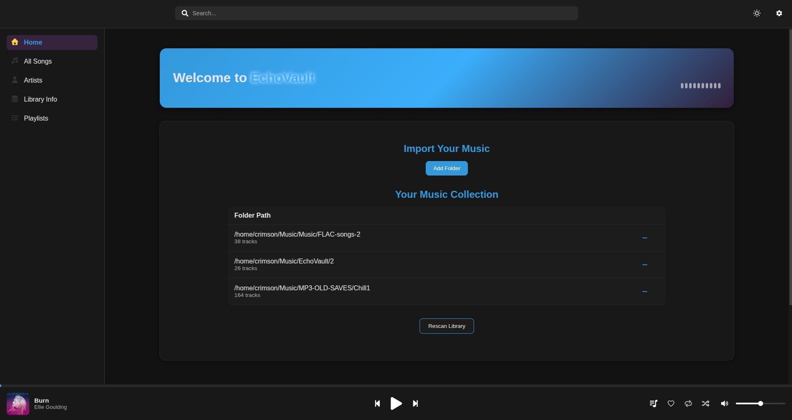
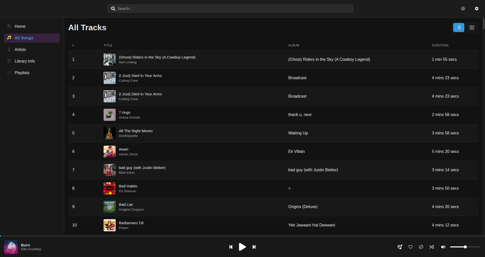
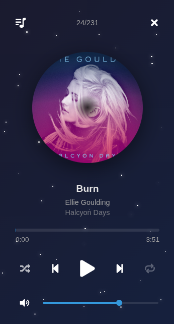
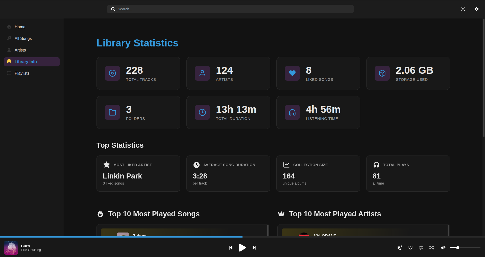
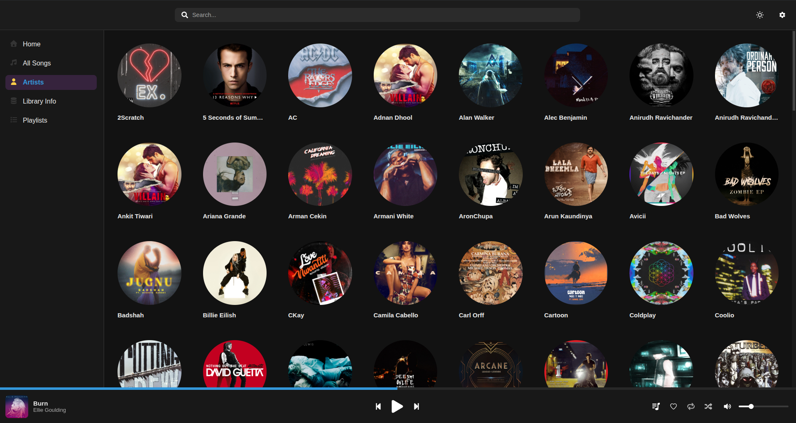

# EchoVault

A modern, high-fidelity music player built with **Electron**, **Vite**, and **Vue**.  
EchoVault is designed to provide a clean, responsive interface and rich playback features for local lossless audio collections.

---

## Table of Contents

1. [Overview](#overview)
2. [Features](#features)
3. [Screenshots](#screenshots)
4. [Installation (Development)](#installation-development)
5. [Available Commands](#available-commands)
6. [Build & Distribution](#build--distribution)
7. [Project Structure](#project-structure)
8. [Contribute](#fork-this-repository)

---

## Overview

EchoVault is a cross-platform desktop application focused on providing smooth, high-quality local music playback.
The project is currently in **Alpha** phase, meaning core features are functional but may be incomplete or unstable.

---

## Features

- High-fidelity playback for FLAC, WAV, ALAC, and MP3 formats
- Local library management with caching for instant load times
- Mini Player mode for a compact, floating playback interface
- Responsive and adaptive UI for all desktop platforms
- Cross-platform builds (Windows, Linux)

---

## Screenshots

### Dark theme











---

## Installation (Development)

Follow these steps to clone the repository and set up your development environment.

### 1. Clone the repository

```bash
git clone https://github.com/ACS-lessgo/EchoVault.git
cd EchoVault
```

2. Select the development branch

```bash

git checkout develop
```

3. Install dependencies
   Make sure you have Node.js (v18 or higher) and npm installed, then run:

```bash

npm install
```

4. Start the development environment
   This will start the Vite renderer and Electron main process:

```bash

npm run start
```

After the build completes, an Electron window should open automatically.

### Available Commands

Command Description

```bash
npm run start | Run EchoVault in development mode using Vite + Electron
npm run lint | Lint the project using ESLint
npm run make | Build and package the app for your current platform
npm run publish | Package and publish to GitHub Releases (requires GITHUB_TOKEN)
npm run package | Create a distributable package without publishing
```

## Build & Distribution

To create a packaged release version for your OS:

```bash
npm run make
```

Output builds are generated in:

```bash
out/make/
```

Typical build outputs:

Windows: .exe installer

Linux: .AppImage and .deb

If you want to publish directly to GitHub Releases:

```bash
export GITHUB_TOKEN=your_token_here
npm run publish
```

## Project Structure

```bash
EchoVault/
├── src/
│ ├── main.js # Electron main process
│ ├── preload.js # Preload scripts
│ ├── frontend/ # Vite + Vue app source
│ ├── backend/ # Local DB and playback utilities
│ └── assets/ # Icons, media, and static files
│
├── forge.config.js # Electron Forge configuration
├── vite.main.config.mjs # Vite configuration for main process
├── vite.renderer.config.mjs # Vite configuration for renderer
├── package.json
├── RELEASE_NOTES.md
└── README.md
```

Release Notes

- See detailed notes for each version in RELEASE_NOTES.md.

- Current stable version: v1.0.0-alpha

## Fork this repository

Create a feature branch:

```bash
git checkout -b feature/your-feature-name
```

Commit your changes:

```bash
git commit -m "Added new feature: your description"
```

Push the branch and open a Pull Request :)
