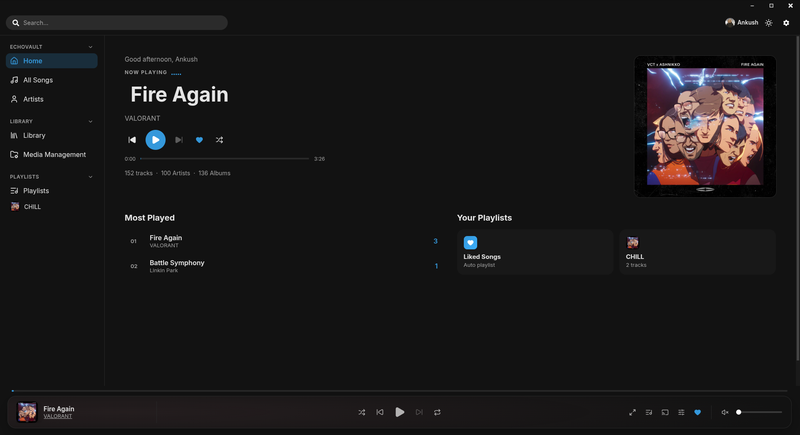
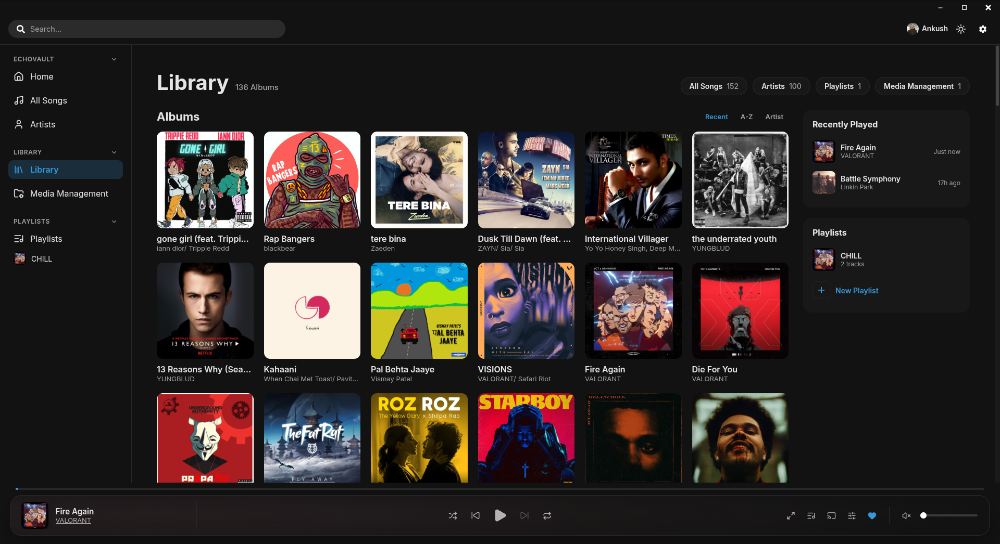
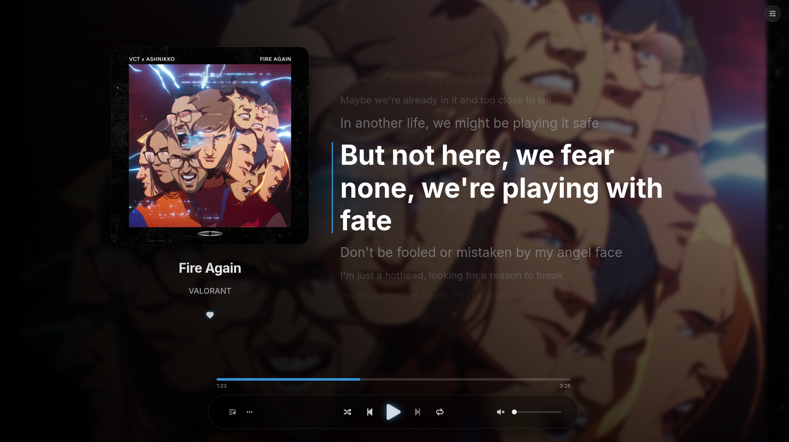
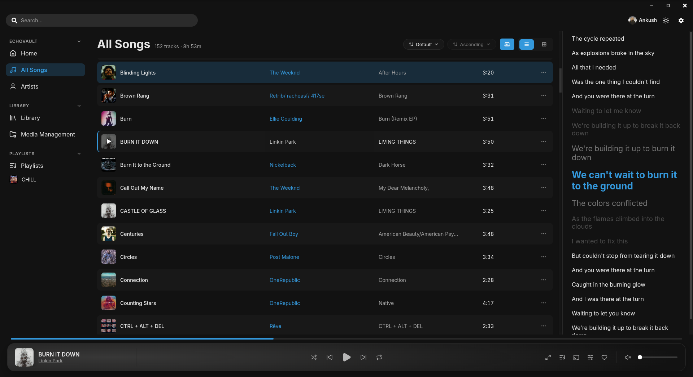
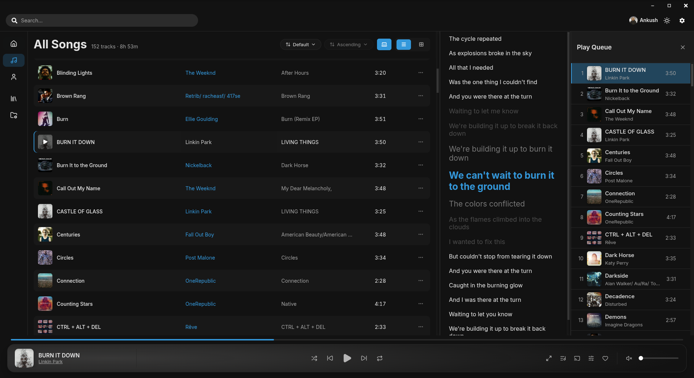
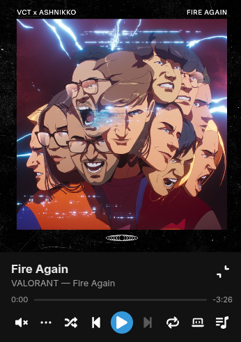

# EchoVault

[](LICENSE)
[](https://github.com/ACS-lessgo/EchoVault/releases)
[](https://github.com/ACS-lessgo/EchoVault/releases)
[](https://github.com/ACS-lessgo/EchoVault)

A modern, high-fidelity music player built with **Electron**, **Vite**, and **Vue**.
EchoVault is designed to provide a clean, responsive interface and rich playback features for local lossless audio collections.

## Related Projects

- **EchoVault CLI** — Official command-line interface for EchoVault.

---

## Table of Contents

1. [Overview](#overview)
2. [Features](#features)
3. [Screenshots](#screenshots)
4. [Installation (Development)](#installation-development)
5. [Available Commands](#available-commands)
6. [Build & Distribution](#build--distribution)
7. [Project Structure](#project-structure)
8. [Contribute](#fork-this-repository)

---

## Overview

EchoVault is a desktop music player for lossless audio (FLAC/WAV/ALAC) and everyday formats (MP3/M4A/AAC/OGG), built on Electron + Vite + Vue 3.

---

## Features

### Playback & Audio Engine

- FLAC, WAV, ALAC, MP3, M4A, AAC, OGG
- Byte-range audio streaming with real seek support — no full-file decode before playback
- 10-band graphic equalizer with 9 presets (Flat, Bass/Treble Booster & Reducer, Vocal Booster, Rock, Pop, Jazz, Classical, Electronic, Acoustic) plus manual per-band override
- Adaptive loudness normalization (live RMS-based gain)
- Output device selection, persisted across restarts
- Playback at the output device's native sample rate
- Perceptual (cubic) volume taper

### AI Audio Enhancement

- One-click MP3 → FLAC upscaling via a locally-downloaded ONNX model
- Inline per-track progress (download + inference phases) right in the song list
- Enhanced result is added as a new track alongside the original

### Library

- Automatic recursive folder scanning
- Live folder watching — new/removed files are picked up automatically, no manual rescan
- Metadata + embedded cover art indexing
- Instant startup through local SQLite caching
- Listening stats: recently played, top played tracks & artists

### Now Playing / Immersive Mode

- Full-screen now-playing view with synced, scrolling lyrics
- Like/unlike, shuffle, repeat, and queue controls built in

### Player Bar & Queue

- Floating glass player bar with a color tint sampled from the current cover art
- Quick-access equalizer, queue, immersive mode, and mini player toggles
- Resizable queue panel with per-track thumbnails and now-playing highlight

### Mini Player

- Compact, always-on-top overlay window for playback on the side

### Playlists

- Create, delete, and manage playlists
- Add or remove tracks from any song list

### Last.fm

- Connect your account and scrobble what you listen to

### Personalization

- Light & dark themes with 8 accent colors
- Customizable keyboard shortcuts
- Local user profile with avatar

### Platform Support

- Windows
- macOS
- Linux

---

## Screenshots

<details>

#### Home Page



#### Library



#### Now Playing (Immersive Mode)



#### Synced Lyrics



#### Queue



#### Mini Player



</details>

## Installation (Development)

Follow these steps to clone the repository and set up your development environment.

### 1. Clone the repository

```bash
git clone https://github.com/ACS-lessgo/EchoVault.git
cd EchoVault
```

### 2. Install dependencies

Make sure you have Node.js **v20.20.2** installed (see `.nvmrc`), then run:

```bash
npm install
```

### 3. Start the development environment

This will start the Vite renderer and Electron main process:

```bash
npm run start
```

After the build completes, an Electron window should open automatically.

### Available Commands

```bash
npm run start   | Run EchoVault in development mode using Vite + Electron
npm run make    | Build and package the app for your current platform
npm run publish | Package and publish to GitHub Releases (requires GITHUB_TOKEN)
npm run package | Create a distributable package without publishing
```

`npm run lint` is currently a no-op and there are no automated tests wired up.

## Build & Distribution

To create a packaged release version for your OS:

```bash
npm run make
```

Output builds are generated in:

```bash
out/make/
```

Typical build outputs:

- Windows: `.exe` installer
- macOS: `.zip`
- Linux: `.AppImage` and `.deb`

If you want to publish directly to GitHub Releases:

```bash
export GITHUB_TOKEN=your_token_here
npm run publish
```

## Project Structure

```bash
EchoVault/
├── src/
│ ├── main.js               # Electron main process
│ ├── preload.js             # Renderer <-> main bridge
│ ├── frontend/              # Vite + Vue app source (components, store, views, router, locales)
│ └── backend/
│   ├── db/                  # SQLite schema and queries
│   └── main/                # IPC handlers, scanner, watcher, player, enhance
│
├── forge.config.js          # Electron Forge configuration
├── vite.main.config.mjs      # Vite configuration for main process
├── vite.preload.config.mjs   # Vite configuration for preload
├── vite.renderer.config.mjs  # Vite configuration for renderer
├── enhancer-manifest.json    # Pinned AI enhancement model/binary manifest
├── package.json
├── CHANGELOG.md
└── README.md
```

## License

This project is licensed under the MIT License.

## Fork this repository

Create a feature branch:

```bash
git checkout -b feature/your-feature-name
```

Commit your changes:

```bash
git commit -m "Added new feature: your description"
```

Push the branch and open a Pull Request :)
