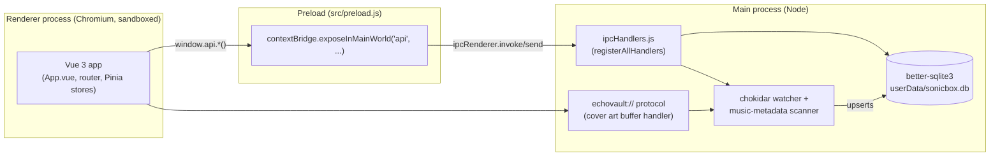

# EchoVault — Technical Specification

> Generated from a full codebase read on 2026-07-02. Reflects the state of `main` at commit `4a22e8d`. Where intent is inferred rather than read directly, it is marked **(assumption)**.

## Project Overview

EchoVault is a desktop music player for lossless and common audio formats (MP3, FLAC, WAV, M4A, OGG, AAC), built as an Electron + Vue 3 application. It scans user-selected folders, extracts embedded metadata/cover art/lyrics via `music-metadata`, stores a library index in a local SQLite database, and provides browsing, queueing, playlists, play-count stats, and theming through a Vue SPA rendered in the Electron window. A companion CLI (`EchoVault-CLI`, Python/PyPI) is planned/advertised but not present in this repository.

## Tech Stack

- **Runtime**: Electron `38.3.0` (main + preload + renderer processes, context isolation on, node integration off)
- **Frontend**: Vue `3.5.22` (Composition + Options API mix), `vue-router` `4.6.3` (hash history), `pinia` `3.0.3`, `vue-i18n` `11.1.12`, `vue3-virtual-scroller` `0.2.3`
- **Backend/data**: `better-sqlite3` `12.4.1` (synchronous SQLite), `music-metadata` `11.9.0` (tag/cover/lyrics extraction), `chokidar` `4.0.3` (filesystem watching)
- **Build/packaging**: Vite `5.4.20` via `@electron-forge/plugin-vite`, Electron Forge `7.10.2` (makers: Squirrel/Windows, zip/macOS, deb/Linux, AppImage/Linux; Fuses hardening plugin)
- **Logging**: `electron-log` `5.4.3`
- **Icons/UI**: `@fortawesome/fontawesome-free`
- **No test framework, no linter configured** (`npm run lint` is a no-op echo)

## Architecture

Three-process Electron model, communicating over IPC through a single `contextBridge`-exposed `window.api`.



- **Main → Renderer trust boundary**: `contextIsolation: true`, `nodeIntegration: false` — the renderer has zero direct Node/FS access; everything crosses through the `window.api` surface defined in `src/preload.js`.
- **Custom protocol**: `echovault://` is registered privileged (standard, secure, CORS-enabled) in `src/main.js:21-32` and handled in `app.whenReady()` to stream cover-art files as buffers directly to `` tags, avoiding base64 round-trips through IPC.
- **No network/server layer** — fully offline, local-file and local-DB only.

## Directory Structure

```
EchoVault/
├── src/
│   ├── main.js              # Electron main entry: window, protocol, DB init, IPC wiring
│   ├── preload.js           # contextBridge surface (window.api)
│   ├── renderer.js          # Vue app bootstrap (theme pre-set, i18n, pinia, router)
│   ├── logger.js            # re-exports electron-log/main as shared logger
│   ├── backend/
│   │   ├── db/
│   │   │   ├── index.js     # initDB(): opens sonicbox.db, WAL mode, indexes
│   │   │   ├── queries.js   # SQL string constants (folders/tracks/artists/search/stats)
│   │   │   └── schema.sql   # source-of-truth DDL, copied into build by Vite plugin
│   │   ├── main/            # one file per IPC-handler domain
│   │   │   ├── ipcHandlers.js  # registerAllHandlers() — wires every domain
│   │   │   ├── library.js      # folder CRUD, rescan, play-count stats
│   │   │   ├── scanner.js      # metadata extraction + recursive folder scan
│   │   │   ├── watcher.js      # chokidar live-watch, add/unlink handling
│   │   │   ├── tracks.js       # track queries, like toggling, embedded lyrics
│   │   │   ├── artists.js      # artist queries
│   │   │   ├── playlists.js    # playlist CRUD (SQL inlined, not via queries.js)
│   │   │   ├── search.js       # track/artist search
│   │   │   ├── player.js       # file streaming for playback, mini-player resize
│   │   │   └── window.js       # window chrome (min/max/close, immersive mode)
│   │   └── utils/
│   │       ├── debounce.js         # generic debounce — unused (dead code)
│   │       └── embeddedLyrics.js   # USLT/SYLT/TXXX lyric tag parsing
│   ├── frontend/
│   │   ├── App.vue          # root shell/layout
│   │   ├── router/index.js  # hash-history routes
│   │   ├── store/           # Pinia: player.js, search.js, theme.js
│   │   ├── utils/playerUtils.js  # playback/queue/volume composables
│   │   ├── components/      # 15 .vue files (see Core Modules)
│   │   └── assets/          # icons, images, index.css
│   └── locales/             # en.json, ja.json (vue-i18n messages)
├── echovault-cli/            # empty placeholder (.gitkeep only) — see External Integrations
├── docs/                     # static marketing/landing page (not built by Vite/Forge)
├── vite.main.config.mjs      # main-process build (externalizes native deps, copies schema.sql)
├── vite.preload.config.mjs   # empty, no customization
├── vite.renderer.config.mjs  # adds @vitejs/plugin-vue
├── forge.config.js           # packaging/makers/Fuses hardening
├── CHANGELOG.md               # running dev log, not dated releases
└── README.md
```

## Core Modules

### `src/backend/db` — persistence layer
- **Purpose**: owns the SQLite connection and schema.
- **Key files**: `index.js` (`initDB()`), `schema.sql`, `queries.js`.
- **Inputs/outputs**: called once at boot from `src/main.js`; returns a `better-sqlite3` `Database` instance passed into `registerAllHandlers(mainWindow, db)`.
- **Notable**: DB file is `sonicbox.db` in `app.getPath("userData")` — a legacy name predating the EchoVault rebrand. No migration system; schema is idempotent `CREATE TABLE IF NOT EXISTS` re-run every boot.

### `src/backend/main/scanner.js` + `watcher.js` — library ingestion
- **Purpose**: turn folders on disk into DB rows. `scanner.js` does one-shot recursive scans (max depth 3, `getFoldersRecursive`) and metadata extraction (`extractMetadata`, writes cover art to `userData/covers/<basename>.jpg`). `watcher.js` keeps a live `chokidar` watcher per folder set, upserting on `add` and deleting rows on `unlink`.
- **Inputs/outputs**: folder paths in, `tracks`/`artists`/`folders` rows out.
- **Notable inconsistency**: supported extension regex differs — scanner includes `.aac`, watcher's does not.

### `src/backend/main/tracks.js` / `artists.js` / `search.js` / `playlists.js` / `library.js` — query layer
- **Purpose**: thin IPC handlers wrapping prepared SQL statements for CRUD/read operations exposed to the renderer.
- **Notable bug**: `library.js:122` (`get-artist-by-name` handler) references `GET_ARTIST_BY_NAME` without importing it from `queries.js` — throws `ReferenceError` at runtime when invoked.
- **Notable inconsistency**: `playlists.js` inlines raw SQL instead of using the `queries.js` constant pattern used everywhere else.

### `src/backend/main/player.js` — playback file I/O
- **Purpose**: serves raw audio bytes to the renderer's Web Audio pipeline via chunked reads (`player:getFileSize`, `player:streamChunk`) rather than exposing file paths directly (keeps file-system access behind IPC). Also owns mini-player window resizing (module-level `isProgrammaticResize`/`isInMiniMode` flags, `setTimeout` debounce).
- **Dead code**: registers `check-mini-mode` handler that is never called from `preload.js`.

### `src/backend/main/window.js` — window chrome
- **Purpose**: minimize/maximize/close, immersive-mode toggle.
- **Bug**: `window.js:24,31` calls `mainWindow.setResizeable(...)` — not a real Electron API (should be `setResizable`, used correctly elsewhere in `player.js:59,83`). Immersive-mode toggle IPC calls will throw.

### `src/frontend/store/player.js` (Pinia, `usePlayerStore`) — client-side playback engine
- **Purpose**: the entire playback engine lives in the renderer, not the main process. Uses `AudioContext`/`decodeAudioData` on chunks streamed via IPC, drives queue/shuffle/repeat/progress state.
- **State**: `currentTrack`, `isPlaying`, `queue[]`, `currentIndex`, `volume`, `repeatMode`, `shuffleEnabled`/`shuffleOrder`/`originalOrder`, `progress`/`duration`/`currentTime`, plus unused fields `cacheStats` and `playHistory`.
- **Known gap**: `repeatMode` ("one"/"all") is tracked but never consulted in `playNext`/`onended` — repeat is effectively unimplemented, matching a CHANGELOG "Known Bug".

### `src/frontend/components` — UI, grouped by feature
- **Shell/chrome**: `App.vue`, `TopBar.vue`, `SideNav.vue`, `Toast.vue`
- **Player controls**: `PlayerBar.vue`, `MiniPlayer.vue`, `ImmersiveMode.vue` (full-screen now-playing view, has a known style-duplication TODO against `PlayerBar.vue`), `QueueSidebar.vue`
- **Library/browse**: `HomePage.vue`, `AllSongs.vue`, `Artists.vue`, `TrackGrid.vue`, `TrackList.vue` (reusable list/grid, likely backed by `vue3-virtual-scroller` for large libraries)
- **Library management**: `LibraryInfo.vue` (largest component, folder add/remove/rescan + stats)
- **Playlists**: `Playlists.vue`
- **Settings**: `Setting.vue` (theme, mini-player/immersive toggles, library entry points)

## Data Flow

**Library scan → playback, end to end:**

1. User adds a folder via `LibraryInfo.vue` → `window.api` → `library:add-folder` IPC → `src/backend/main/library.js` inserts into `folders`, triggers `scanner.scanFolder(db, folderPath)`.
2. `scanner.js` recurses the folder tree (depth ≤ 3), calls `extractMetadata()` per audio file (`music-metadata`), writes cover art to `userData/covers/`, upserts rows into `tracks`/`artists` via prepared statements from `queries.js`.
3. `watcher.js` starts/restarts a `chokidar` watcher over all known folders so subsequent file adds/removes update the DB live without a manual rescan.
4. Renderer requests library data (`tracks:get-tracks`, `artists:get-artists`, etc.) on route mount; results render in `TrackList`/`TrackGrid`/`Artists.vue`.
5. User clicks a track → `usePlayerStore.playTrack()` calls `player:getFileSize` then repeated `player:streamChunk` invocations, reassembles an `ArrayBuffer`, decodes via Web Audio `decodeAudioData`, plays through a `gainNode`.
6. Cover art in the UI is requested directly as ``, handled by the protocol buffer handler registered in `src/main.js`, bypassing IPC entirely.
7. Play events increment `noOfPlays` via `increment-play-count`, feeding `get-top-played-tracks`/`get-top-played-artists` stats views.

## External Dependencies & Integrations

- **SQLite (`better-sqlite3`)** — sole persistent store; local file `userData/sonicbox.db`, WAL mode, no server.
- **`music-metadata`** — reads embedded ID3/Vorbis/APE tags, cover art, and lyrics (USLT/SYLT/TXXX) from audio files; no external network calls.
- **`chokidar`** — local filesystem watching only.
- **`echovault-cli`** — directory is an empty placeholder (`.gitkeep` only) in this repo. `docs/index.html` advertises it as a separate Python TUI published on PyPI as `EchoVault-CLI` (`pip install EchoVault-CLI`). **(assumption)**: if/when implemented, it would need to read the same `sonicbox.db` SQLite file or some other bridge — nothing in this repo defines that interface; git history references a CLI commit not present in this tree.
- **`docs/`** — static marketing/landing page (plain HTML/CSS/JS, loads Lucide icons from a CDN), not built or served by the Electron app; appears intended for separate hosting (e.g. GitHub Pages).
- **No auth, no remote APIs, no analytics/telemetry found.**

## Configuration & Environment

- **No `process.env` usage anywhere in `src/`** — the app has no environment-variable-driven configuration. `README.md` mentions `GITHUB_TOKEN` for `npm run publish`, but that's consumed by Electron Forge's publish tooling, not app code.
- **No `.env`/`.env.example` files** in the repo.
- **Settings persistence is split across two mechanisms**, not a unified settings store:
  - Theme (`dark`/`light`): `localStorage` only (`src/renderer.js`, `src/frontend/store/theme.js`) — not in SQLite.
  - Library folders, liked tracks, play counts, playlists: SQLite (`sonicbox.db`).
  - Window size / mini-player state: transient, in-memory only in `src/backend/main/player.js` — not persisted across restarts.
- **Secrets handling**: none applicable — no credentials, tokens, or API keys used by the app itself.
- **Build-time config**: `vite.main.config.mjs` externalizes native/node modules (`better-sqlite3`, `fs`, `path`, `os`) and copies `schema.sql`/`app-icon.png` into the build output via a custom `copy-schema` plugin (explicitly commented "dont modify if u dont know the build process"). `forge.config.js` similarly warns not to touch its `ignore` regex, which whitelists `better-sqlite3`/`bindings`/`file-uri-to-path` from asar exclusion since they're loaded unbundled at runtime.

## Known Gaps / TODOs

Sourced from in-code comments, CHANGELOG.md, and issues found during this read:

- **`src/backend/main/library.js:122`** — `get-artist-by-name` handler uses `GET_ARTIST_BY_NAME` without importing it → `ReferenceError` at runtime.
- **`src/backend/main/window.js:24,31`** — `mainWindow.setResizeable(...)` typo (real API is `setResizable`) → immersive-mode toggle throws at runtime.
- **`src/frontend/store/player.js`** — `repeatMode` state exists but isn't applied in `playNext`/`onended`; repeat "one"/"all" is effectively unimplemented. Matches CHANGELOG's documented queue-end playback bug.
- **`vite.main.config.mjs:18`** — CSP references an `echovault-cover:` scheme that doesn't match the actually-registered `echovault:` protocol in `src/main.js` — stale/mismatched entry.
- **Extension filter mismatch** — `scanner.js` supports `.aac`, `watcher.js`'s live-watch filter does not.
- **Cover art collisions** — cover files are written as `path.basename(filePath) + ".jpg"` with no folder disambiguation; two same-named files in different folders will overwrite each other's cover art. Documented in CHANGELOG "Known Bugs".
- **Dead code**: `src/backend/utils/debounce.js` (no call sites), `extractEmbeddedLyricsDebug` in `src/backend/utils/embeddedLyrics.js` (lines 300-467, unused debug twin), `check-mini-mode` IPC handler (`player.js:105`, never invoked from preload), `cacheStats`/`playHistory` fields in the player store (declared, never used).
- **`src/backend/main/scanner.js:53`** — stale `TODO: Make this recursive...` comment; recursion (`getFoldersRecursive`) is already implemented just below it.
- **`src/frontend/components/ImmersiveMode.vue:247`** — TODO acknowledging duplicated styles from `PlayerBar.vue` that need cleanup.
- **DB filename** — still `sonicbox.db`, a legacy name from before the EchoVault rebrand.
- **README/CHANGELOG drift** — `README.md` describes the project as "Alpha phase" while `package.json` is at `1.0.1-beta`; README references a `RELEASE_NOTES.md` that doesn't exist; CHANGELOG's last entry (2025-11-09) predates the most recent commits.
- **CHANGELOG-documented known bugs not yet cross-verified against code**: player "silently fails" requiring a manual refresh; FLAC duration reporting `NaN`; watcher over-triggering events.
